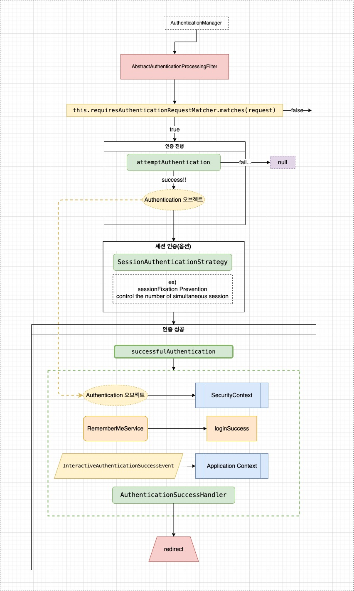
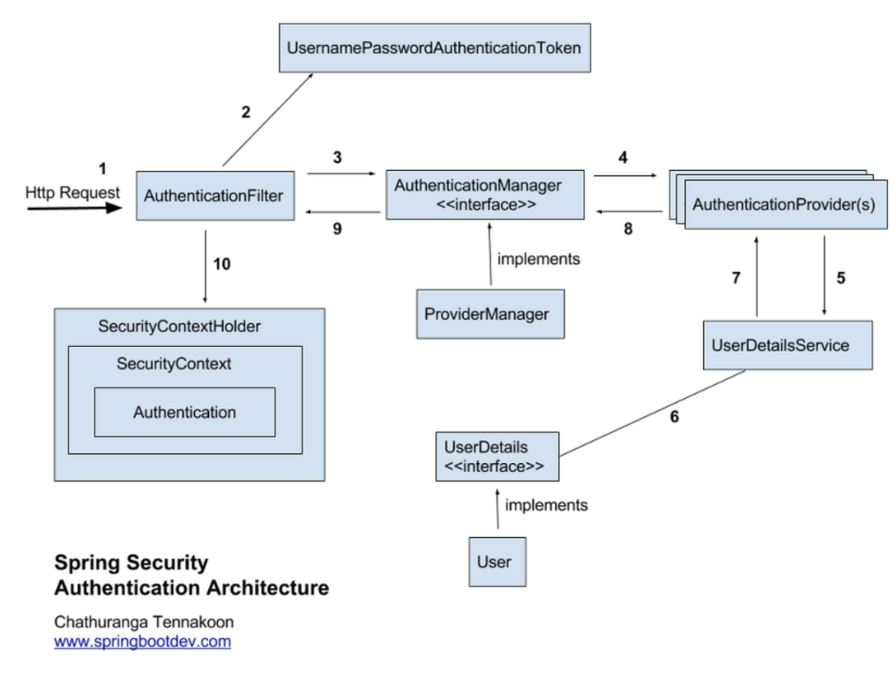

[Zipkin 시작하기](#Zipkin 시작하기)

[gradle로 Docker 이미지 빌드하기](#gradle로 Docker 이미지 빌드하기)

[SecurtityConfig 설정](Spring%20Security.md)

#### AbstractAuthenticationProcessingFilter

GenericFilterBean의 상속을 받고 있고, subclass로는 OAuth2LoginAuthenticationFilter, Saml2WebSsoAuthenticationFilter, UsernamePasswordAuthenticationFilter가 있다.


  출처 : [on5949.log](https://velog.io/@on5949/SpringSecurity-AbstractAuthenticationProcessingFilter-%EC%99%84%EC%A0%84-%EC%A0%95%EB%B3%B5)





#### log4j2 설정하기

1. 자바 스프링 부트의 Default 자바 로깅 프레임워크는 logback이다. 아래와 같이 'org.springframework.boot:spring-boot-starter-web'에는 logback이 기본적으로 구형되어 있다.

  ```groovy
  dependencies {
      implementation 'org.springframework.boot:spring-boot-starter-web'          
  }
  ```

  기존 자바 로깅 프레임워크인 logback의 종속성을 제거해주며, Log4j2 프레임워크의 종속성을 추가한다.

  ```groovy
  configurations {
      all {
          exclude group: 'org.springframework.boot', module: 'spring-boot-starter-logging'
      }
  }

  dependencies {
    implementation 'org.springframework.boot:spring-boot-starter-log4j2'
  }
  ```


  /src/main/resources 경로에 log4j2.xml 파일을 생성

  ```xml
  <?xml version="1.0" encoding="UTF-8"?>
  <Configuration status="INFO">
      <Properties>
          <Property name="logNm">Spring Log4j2</Property>
          <Property name="layoutPattern">%style{%d{yyyy/MM/dd HH:mm:ss,SSS}}{cyan} %highlight{[%-5p]}{FATAL=bg_red, ERROR=red,
              INFO=green, DEBUG=blue}  [%C] %style{[%t]}{yellow} %m%n</Property>
      </Properties>
      <Appenders>
          <Console name="Console_Appender" target="SYSTEM_OUT">
              <PatternLayout pattern="${layoutPattern}"/>
          </Console>
          <RollingFile name="File_Appender" fileName="logs/${logNm}.log" filePattern="logs/${logNm}_%d{yyyy-MM-dd}_%i.log.gz">
              <PatternLayout pattern="${layoutPattern}"/>
              <Policies>
                  <SizeBasedTriggeringPolicy size="1000KB"/>
                  <TimeBasedTriggeringPolicy interval="1"/>
              </Policies>
              <DefaultRolloverStrategy max="10" fileIndex="min"/>
          </RollingFile>
      </Appenders>
      <Loggers>
          <Root level="INFO" additivity="false">
              <AppenderRef ref="Console_Appender"/>
              <AppenderRef ref="File_Appender"/>
          </Root>
          <Logger name="org.springframework" level="DEBUG"
                  additivity="false">
              <AppenderRef ref="Console_Appender" />
              <AppenderRef ref="File_Appender"/>
          </Logger>
          <!--하단 name에 본인이 사용하는 package명으로 수정할 것-->
          <Logger name="com.yeopbox.main.controller" level="INFO" additivity="false">
              <AppenderRef ref="Console_Appender" />
              <AppenderRef ref="File_Appender"/>
          </Logger>
          <Logger name="org.springframework" level="TRACE" additivity="false">
              <AppenderRef ref="Console_Appender" />
          </Logger>
      </Loggers>
  </Configuration>
  ```

  ```java
  import org.apache.logging.log4j.LogManager;
  import org.apache.logging.log4j.Logger;
  
  // Log4j Logger
  private static final log = LogManager.getLogger(Class.class);
  ```

#### Zipkin 시작하기

* zipkin 설치 방법 1 (jar 파일 실행)

  ```cmd
   $> curl -sSL https://zipkin.io/quickstart.sh | bash -s
   $> java -jar zipkin.jar
  ```

* zipkin elasitc 저장소 실행

  ```cmd
   $> java -jar zipkin.jar --STORAGE_TYPE=elasticsearch --ES_HOST=http://127.0.0.1:9200
  ```

* zipkin 설치 방법 1 ()
  ```cmd
  $> docker run -d -p 9411:9411 openzipkin/zipkin
  ```

  ```yaml
  version: "3.3" # 파일 규격 버전
  services: # 이 항목 밑에 실행하려는 컨테이너 들을 정의
    
    zipkin:
      image: openzipkin/zipkin
      container_name: zipkin
      # environment:
      #   - STORAGE_TYPE=elasticsearch
      #   - ES_HOSTS=localhost:9200 ## 도커로 엘라스틱 저장소 연결하는거는 다음처럼 했을때 안됐음.
      ports:
      - "9411:9411"
  ```
* Spring Cloud Sleuth란?

  Spring에서 공식적으로 지원하는 Zipkin Client Library로 Spring과의 연동이 매우 쉬우며, 호출되는 서비스에 Trace ID와 Span ID를 부여한다.

  Zipkin의 Brave는 B3-propagation의 Java 구현체이고, Spring Cloud Sleuth는 BraveTracer를 Spring 프레임워크에서 쉽게 사용하기 위한 라이브러리입니다.


#### gradle에서 사용하는 기본 플러그인

```groovy
plugins {
    id 'java'
    id 'org.springframework.boot'           version '3.0.1'
    id 'io.spring.dependency-management'    version '1.1.0'
    id "com.palantir.docker"                version "0.34.0"
}
```

#### gradle로 Docker 이미지 빌드하기

 - com.palanti.docker 플러그인 사용


