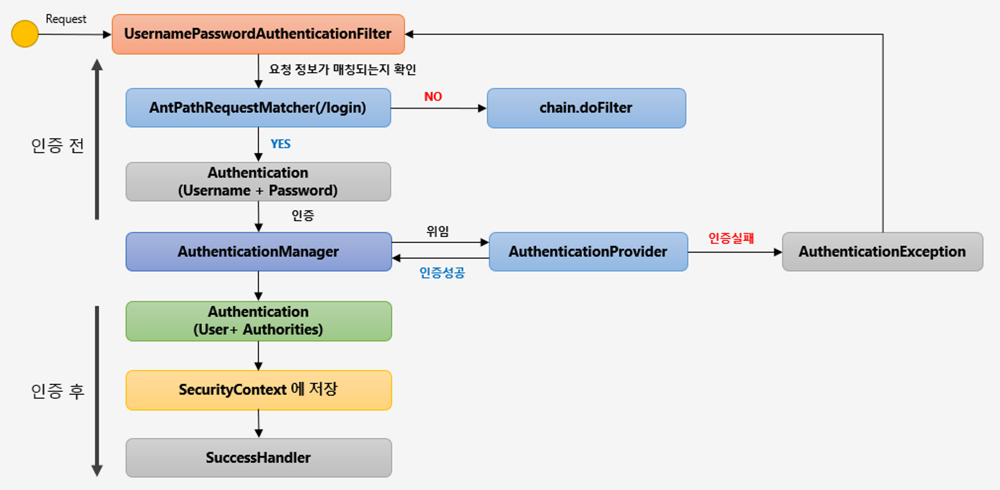
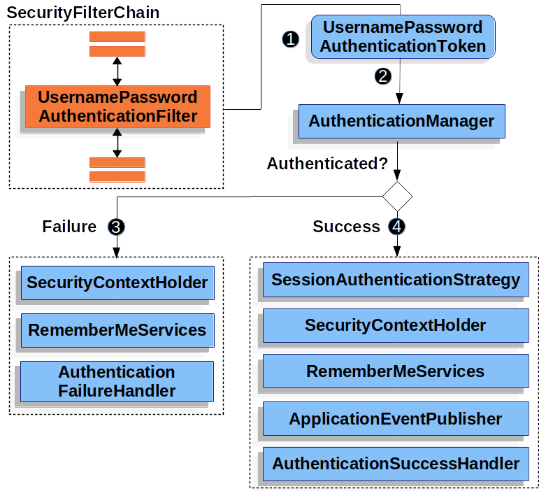

## Spring Security Architecture

  * SecurityContextHolder
  * SecurityContext
  * Authentication
    * Principal과 GrantAuthority 정보를 제공.
    * Principal
      * 인증된 사용자 정보 즉, "누구"에 해당하는 정보.
      * UserDetailsService에서 리턴한 그 객체.
      * 객체는 UserDetails 타임.
        * UserDetails : 어플리케이션이 가지고 있는 유저 정보와 스프링 시큐리티가 사용하는 Authentication 객체 사이의 어댑터
    * GrantAuthority
      * "ROLE_USER", "ROLE_ADMIN"등 Principal이 가지고 있는 "권한"을 나타낸다.
      * 인증 이후, 인가 및 권한 확인할 때 이 정보를 참조한다.

### AuthenticationManagerBuilder

  UserDetailsService의 구현클래스(AccountService)를 구현하고 SecurityConfig에서 명시적으로 아래와 같이 등록
  ```java
    AuthenticationManagerBuilder auth;
    auth.userDetailsService(accountService);
  ```
  AccountService를 빈으로 등록만 해주면, 명시적으로 지정해주지 않아도 해당 빈을 사용하여 인증하도록 되어 있다.


### AuthenticationManager

스프링 시큐리티에서 인증(Authentication)은 AuthenticationManager가 한다.

## 스프링 부트 시큐리티 자동 설정

### UserDetailsServiceAutoConfiguration

spring-boot-autoconfigure의 security 쪽 자동 설정 중 하나인 UserDetailsServiceAutoConfiguration는 UserDetailsManager를 만들어 랜덤하게 유저가 만드렁지게 된다.

```java
@AutoConfiguration
@ConditionalOnClass(AuthenticationManager.class)
@ConditionalOnBean(ObjectPostProcessor.class)
@ConditionalOnMissingBean(
		value = { AuthenticationManager.class, AuthenticationProvider.class, UserDetailsService.class,
				AuthenticationManagerResolver.class },
		type = { "org.springframework.security.oauth2.jwt.JwtDecoder",
				"org.springframework.security.oauth2.server.resource.introspection.OpaqueTokenIntrospector",
				"org.springframework.security.oauth2.client.registration.ClientRegistrationRepository",
				"org.springframework.security.saml2.provider.service.registration.RelyingPartyRegistrationRepository" })
public class UserDetailsServiceAutoConfiguration {
```


* SecurtityConfig 설정

  ```java
  @Configuration
  @EnableWebSecurity // 웹보안 활성화를 위한 annotation
  public class SecurityConfig extends WebSecurityConfigurerAdapter {
  
    @Override
    public void configure(WebSecurity web) throws Exception {
      // resources 모든 접근을 허용하는 설정을 해버리면
      // HttpSecurity 설정한 ADIM권한을 가진 사용자만 resources 접근가능한 설정을 무시해버린다.
      web.ignoring().antMatchers("/resources/**");
    }
  
    @Override
    protected void configure(HttpSecurity http) throws Exception {
        http
            .authorizeRequests()            // 요청에 의한 보안검사 시작
            .anyRequest().authenticated()   // 어떤 요청에도 보안검사를 한다.
        .and()
            .formLogin();                   // 보안 검증은 formLogin방식으로 하겠다.
    }
  }
  ```
  - @EnableWebSecurity annotation을 WebSecurityConfigureAdapter를 상속하는 설정 객체에 붙혀주면 SpringSecurityFilterChain에 등록된다.
  
  1. WebSecurity 설정
  2. HttpSecurity 설정

### AuthenticationFilter 필터 리스트

- WebAsyncManagerInteggrationFilter
- SecurityContextPersistenceFilter
- HeaderWriterFilter
- CsrfFilter
- LogoutFilter
- UsernamePasswordAuthenticationFilter
- RequestCacheAwareFilter
- AnonymouseAuthenticationFilter
  - 이 필터에 올 때까지 앞에서 사용자 정보가 인증되지 않았다면, 이 요청은 익명의 사용자가 보낸 것으로 판단하고 처리한다.  
    (Authentication 객체를 새로 생성함 - AnonymouseAuthenticationToken)
- SessionManagementFilter
  - 세션 변조 공격 방지 (SessionId를 계속 다르게 변경해서 클라이언트에 내려준다)
  - 유효하지 않은 세션으로 접근했을 때 URL 핸들링
  - 하나의 세션 아이디로 접속하는 최대 센션 수(동시 접속) 설정
- ExceptionTranslationFilter
- FilterSecurityInterceptor
  - 인가(Authorization)를 결정하는 AccessDecisionManager에게 접근 권한이 있는지 확인하고 처리하는 필터 

> 스프링시큐리티는 각각 역할에 맞는 필터들이 체인형태로 구성되서 순서에 맞게 실행되는 구조로 동작합니다.  
  사용자는 특정 기능의 필터를 생성하여 등록 할 수 있습니다. 인증을 처리하는 기본필터 UsernamePasswordAuthenticationFilter 대신 별도의 인증 로직을 가진 필터를 생성하고 사용하고 싶을 때 아래와 같이 필터를 등록 하고 사용합니다.
    
  ```java
  @EnableWebSecurity
  public class BrmsWebSecurityConfiguration extends WebSecurityConfigurerAdapter {
    @Override
    public void configure(HttpSecurity http) throws Exception {
        http.addFilterBefore(new CustomAuthenticationProcessingFilter("/login-process"),
                UsernamePasswordAuthenticationFilter.class);
    }
  }
  ```

### Login Form 인증 필터

> UsernamePasswordAuthenticationFilter
 
#### Login Form 인증 로직 플로우

  * 로그인 인증처리를 담당하고 인증처리에 관련된 요청을 처리하는 필터  
    
  UsernamePasswordAuthenticationFilter - Logic

  

  * 인증처리 필터(UsernamePasswordAuthenticationFilter)는 Form인증처리를 하는 필터로써 해당 필터는 크게 두가지로 인증 전과 후의 작업을 관리한다.  
    인증처리전에는 사용자 인증정보를 담아서 전달하면서 인증처리를 맡기고(AuthenticationManager) 성공한 인증객체를 반환받아서 (전역적으로 인증객체를 참조할 수 있도록 설계 된)SecurityContext에 저장하고, 그 이후 SuccessHandler를 통해 인증 성공후의 후속 작업들을 처리합니다.

  * 사용자가 로그인 페이지에 접근해 로그인 요청을 하면 UsernamePasswordAuthenticationFilter에서 사용하는 AuthenticationProvider 구현체에서 UserDetailsService의 loadUserByUsername 메소드를 통해 로그인시 요청 받은 username을 통해 UserDetails 객체를 얻게 된다.

### LogoutFilter 란

> LogoutFilter
 
  LogoutFilter는 세션 무효화, 인증토큰 삭제, SecurityContext에서 해당 토큰 삭제, 쿠키 삭제 및 로그인 페이지로 리다리렉트를 시켜주는 기능이 있다.

  LogoutFilter의 필터 기능이 구현된 코드
  ```java
  private void doFilter(
          HttpServletRequest request
        , HttpServletResponse response
        , FilterChain chain
        ) throws IOException, ServletException{
    if (this.requiresLogout(request, response)) {
      Authentication auth = SecurityContextHolder.getContext().getAuthentication();
      if (this.logger.isDebugEnabled()) {
        this.logger.debug(LogMessage.format("Logging out [%s]", auth));
      }
  
      this.handler.logout(request, response, auth);
      this.logoutSuccessHandler.onLogoutSuccess(request, response, auth);
    } else {
      chain.doFilter(request, response);
    }
  }
  ```


