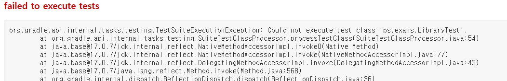
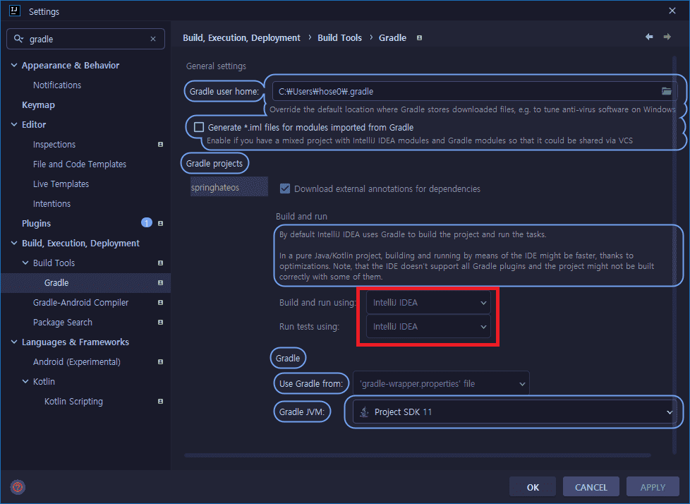

# Sprint MVC Tomccat 배포

 ## web.xml을 이용한 배포

 * spring framework 버전에 따른  Java EE, Jakarta EE 의 호환 문제

## Java EE(Java Platform, Enterprise Edition)

자바EE는 1999년 썬 마이크로시스템즈가 J2EE(Java 2 Enterprise Edition) 명으로 발표한 분산 애플리케이션 개발 목적의 산업 표준 플랫폼이다. 기업용 애플리케이션을 개발·실행하기 위한 기술과 환경을 제공하며 서블릿(Servlet), JSP, EJB, JDBC, JNDI, JMX, JTA 등의 알려진 기술을 포함하고 있다. 자바EE의 주요 목적은 특정 운영체제와 미들웨어에 종속되지 않고 정보 교환 및 애플리케이션 호환이 가능한 플랫폼을 제공하는 것이다.

## 새로운 시작, Jakarta EE(Java Platform, Enterprise Edition)

이클립스 재단으로 이관된 자바EE의 공식 명칭은 자카르타EE, 프로젝트 명은 EE4J(Eclipse Enterprise for Java)로 변경되었다.

## Spring Framework 5 -> 6 의 변화

 * javax 패키지 변경

## ContextLoaderListener 이란?

> ContextLoaderListener 클래스는 서블릿 컨테이너가 web.xml 파일을
읽어서 구동될때, 자동으로 메모리에 생성된다. 즉, ContexLoaderListener는
클라이언트의 요청이 없어도 컨테이너에 구동될때 Pre-Loading되는 객체이다.

```xml
<listener>
    <listener-class>org.springframework.web.context.ContextLoaderListener</listener-class>
</listener>

<context-param>
    <param-name>contextConfigLocation</param-name>
    <param-value>
        /WEB-INF/applicationContext.xml
        /WEB-INF/applicationContext_dao.xml
    </param-value>
</context-param>

<servlet>
    <servlet-name>Controller</servlet-name>
    <servlet-class>org.springframework.web.servlet.DispatcherServlet</servlet-class>
    <init-param>
        <param-name>contextConfigLocation</param-name>
        <param-value>/WEB-INF/servlet.xml</param-value>
    </init-param>
    <load-on-startup>1</load-on-startup>
</servlet>
```


```java
 public class MyWebAppInitializer implements WebApplicationInitializer {

    @Override
    public void onStartup(ServletContext container) {
      // Create the 'root' Spring application context
      AnnotationConfigWebApplicationContext rootContext =
        new AnnotationConfigWebApplicationContext();
      rootContext.register(AppConfig.class);

      // Manage the lifecycle of the root application context
      container.addListener(new ContextLoaderListener(rootContext));

      // Create the dispatcher servlet's Spring application context
      AnnotationConfigWebApplicationContext dispatcherContext =
        new AnnotationConfigWebApplicationContext();
      dispatcherContext.register(DispatcherConfig.class);

      // Register and map the dispatcher servlet
      ServletRegistration.Dynamic dispatcher =
        container.addServlet("dispatcher", new DispatcherServlet(dispatcherContext));
      dispatcher.setLoadOnStartup(1);
      dispatcher.addMapping("/");
    }

 }
 ```




[gradle build 관련 오질문 답](https://www.inflearn.com/questions/459145/gradle-build-%EA%B4%80%EB%A0%A8-%EC%98%A4%EB%A5%98-%EC%A7%88%EB%AC%B8-%EB%93%9C%EB%A6%BD%EB%8B%88%EB%8B%A4-testsuiteexecutionexception)


혹시 Edit Custom VM options 에서

Dfile.encoding=UTF-8
Dconsole.encoding=UTF-8
옵션을 지정하지 않으셨나요?? 이런 상태에서 지금 현재 프로젝트가 위치한 상위 경로에 한글파일 폴더가 존재하는 상황이신가요? 이러한 상황이라면 그 한글파일 폴더 이름을 영어로 바꾸시면 정상적으로 작동됩니다.

이러한 에러가 생기는 원인은 Windows에서 사용하는 한글 인코딩과 JVM에서 사용하는 file encoding이 달라서 프로젝트의 파일들을 제대로 읽지 못하는 문제로 보입니다.

