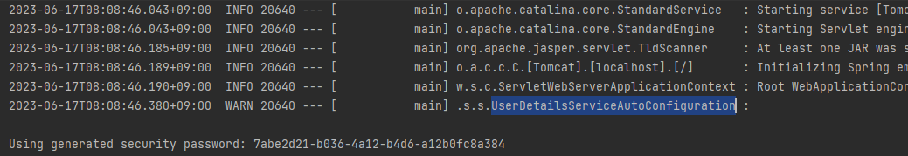

# Spring Boot 에서 Spring Security 사용하기

## Spring Security 기본 로그인 화면

- 기본 로그인 페이지를 없애려면 어플리케이션이 실행되는 클래스의 @SpringBootApplication 에서 ```java (exclue = SecurityAutoConfiguration.Class)``` 옵션을
  주면 로그인 페이지가 나오지 않는다(Spring Security 모든 기능이 해지된다).


## Spring Security 기본 비밀번호

- [ ] 기본 비밀번호 생성


```java
@AutoConfiguration
@ConditionalOnClass(AuthenticationManager.class)
@ConditionalOnBean(ObjectPostProcessor.class)
@ConditionalOnMissingBean(
		value = { AuthenticationManager.class, AuthenticationProvider.class, UserDetailsService.class,
				AuthenticationManagerResolver.class },
		type = { "org.springframework.security.oauth2.jwt.JwtDecoder",
				"org.springframework.security.oauth2.server.resource.introspection.OpaqueTokenIntrospector",
				"org.springframework.security.oauth2.client.registration.ClientRegistrationRepository",
				"org.springframework.security.saml2.provider.service.registration.RelyingPartyRegistrationRepository" })
public class UserDetailsServiceAutoConfiguration {
    ...

    private String getOrDeducePassword(SecurityProperties.User user, PasswordEncoder encoder) {
        String password = user.getPassword();
        if (user.isPasswordGenerated()) {
            logger.warn(String.format(
                    "%n%nUsing generated security password: %s%n%nThis generated password is for development use only. "
                            + "Your security configuration must be updated before running your application in "
                            + "production.%n",
                    user.getPassword()));
            
```

@ConditionalOnMissingBean 를 살펴보면 4개의 클래스가 걸려있어 이것이 확성화 되는 것을 결정한다.

조건 ```if (user.isPasswordGenerated())``` 을 충족하기 위한 방법으로는 

```java
package org.springframework.boot.autoconfigure.security;

@ConfigurationProperties(prefix = "spring.security")
public class SecurityProperties {
    ...
    
    public static class User {
        ...

        public void setPassword(String password) {
            if (!StringUtils.hasLength(password)) {
                return;
            }
            this.passwordGenerated = false;
            this.password = password;
        }        
        ...
        
        public boolean isPasswordGenerated() {
            return this.passwordGenerated;
        }
```

application.properties에서 비밀번호를 아래와 같이 설정할 수 있다.

```properties
spring.security.user.passowrd=[패스워드]
```


## DelegatingFilterProxy & FilterChainProxy


### ServletFilter

Tomcat과 같은 WAS에서 실행되는 필터이다.


DelegatingFilterPorxy -> FilterChainProxy -> SecurityFilterChain 순으로 진행


```java
package org.springframework.security.config.annotation.web.configuration;

@Configuration(proxyBeanMethods = false)
class HttpSecurityConfiguration {
  ...

  @Bean(HTTPSECURITY_BEAN_NAME)
  @Scope("prototype")
  HttpSecurity httpSecurity() throws Exception {
    LazyPasswordEncoder passwordEncoder = new LazyPasswordEncoder(this.context);
    AuthenticationManagerBuilder authenticationBuilder = new DefaultPasswordEncoderAuthenticationManagerBuilder(
            this.objectPostProcessor, passwordEncoder);
    authenticationBuilder.parentAuthenticationManager(authenticationManager());
    authenticationBuilder.authenticationEventPublisher(getAuthenticationEventPublisher());
    HttpSecurity http = new HttpSecurity(this.objectPostProcessor, authenticationBuilder, createSharedObjects());
    WebAsyncManagerIntegrationFilter webAsyncManagerIntegrationFilter = new WebAsyncManagerIntegrationFilter();
    webAsyncManagerIntegrationFilter.setSecurityContextHolderStrategy(this.securityContextHolderStrategy);
    // @formatter:off
    http
            .csrf(withDefaults())
            .addFilter(webAsyncManagerIntegrationFilter)
            .exceptionHandling(withDefaults())
            .headers(withDefaults())
            .sessionManagement(withDefaults())
            .securityContext(withDefaults())
            .requestCache(withDefaults())
            .anonymous(withDefaults())
            .servletApi(withDefaults())
            .apply(new DefaultLoginPageConfigurer<>());
    http.logout(withDefaults());
    // @formatter:on
    applyDefaultConfigurers(http);
    return http;
  }
    
```

```java
package org.springframework.security.web.context.request.async;

public final class WebAsyncManagerIntegrationFilter extends OncePerRequestFilter {

```


- [ ] BasicAuthenticationFilter

이 필터는 설정 클래스에서 ```http.httBasic();``` 으로 설정해주면 HttpBasic 인증을 지원하는 필터를 포함하는 FilterChainProxy를 제공

base 인증?

요청 헤더에 username 과 password를 base64로 인코딩한 값을 실어서 보내는 것이다.


- [ ] RequestCacheAwareFilter

현재 요청과 관련있는 캐시 요청이 있는지 확인하고 있으면 캐시 요청을 처리해준다.


