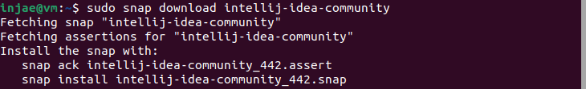

# Spring-Framework
어디까지 공부할수 있을까?

## 2023.06.29

| 키워드                          | 내용                                                                                                    |
|------------------------------|-------------------------------------------------------------------------------------------------------|
| spring-boot-starter-parent   | 라이브러리 간 의존성 관리 및 버전 충돌에 대한 이슈를 예방해줌                                                                   |
| spring-boot-starter-actuator | 스프링 부트 애플리케이션에서 제공하는 여러가지 정보를 모니터링하ㅔ 할 수 있게 도와줌                                                       |
| spring-boot-starter-web      | Spring MVC를 사용하여 RESTful을 포함한 웹 애플리케이션을 구축하기 위한 시작 장치로 Tomcat을 기본 내장 컨테이너로 사용할 수 있게 해줌                |
| spring-boot-starter-devtools | Spring Boot에서 개발 편의를 위해 제공하는 라이브러리로 클래스 로딩 문제 진단, 속성 기본값, 자동 재시작, 라이브 리로드, 전역 설정, 원격 애플리케이션 등의 기증을 제공 |
| maven-resources-plugin       | 메이븐에 스프링 부트 애플리케애션의 빌드와 배포를 위한 스프링 전용 메이븐 플러그인 포함                                                     |


### 우분투에서 intellij 설치

```bash
$> sudo snap install intellij-idea-community --classic
$> sudo snap download intellij-idea-community
```
> 

- [ ] snap 명령어
```bash
# 시스템에 설치된 스냅 요약을 표시
$> snap list

# 사용 중인 스탬의 현재 버전을 나열하려면 이름을 지정, --all 옵션을 추가하여 사용 가능한 것 나열
$> snap list mailspring
$> snap list --all mailspring

# 스냅 업데이트 및 되돌리기
$> sudo snap refresh mailspring
$> sudo snap revert mailspring
```

### MSA 에서의 트랙잭션

#### 2 Phase Commit Protocol

#### Sagas pattern

[참고](https://kingjakeu.github.io/study/2021/07/20/msa-transaction/)

### Spring Cloud Config 란

Spring Cloud Config는 분산 시스템에서 remote configuration 을 제공

- [ ] 의존성

  implementation 'org.springframework.cloud:spring-cloud-config-server:4.0.3'

  implementation("org.springframework.cloud:spring-cloud-starter-config")
 
  implementation("org.springframework.cloud:spring-cloud-config-client")
 
  implementation("org.springframework.boot:spring-boot-starter-actuator")
 
  implementation("org.springframework.boot:spring-boot-starter-aop")

```yaml
spring:
  cloud:
    config:
      enabled: true
      server:
        jdbc:
          sql: select prop_key, prop_value from remote_configurations where application=? and profile=? and label=?
  datasource:
    url: jdbc:mysql://localhost:3306/config-server
    username: <database-username>
    password: <database-password>
    driver-class-name: org.mariadb.jdbc.Driver
  profiles:
    active:
      - jdbc
      - local
```

```yaml
management:
  endpoints:
    web:
      exposure:
        include: "refresh"
spring:
  profiles:
    active: local
  config:
    import: "optional:configserver:http://localhost:8080"
  cloud:
    config:
      name: jaehun-microservice-router
      fail-fast: true 
      retry:
        initial-interval: 1000
        max-attempts: 5
        multiplier: 1.1
      request-connect-timeout: 2000
      request-read-timeout: 10000
```

[참고](https://jaehun2841.github.io/2022/03/10/2022-03-11-spring-cloud-bus/#Spring-Cloud-Bus)

## 2023.06.19
- intellij 에서 프로젝트와 모듈의 관계.
  
```java
import com.intellij.openapi.module.ModuleManager;
...

    for (Module module : ModuleManager.getInstance(myProject).getModules()) {
      ModuleRootManager rootManager = ModuleRootManager.getInstance(module);
```

- 플러그인 추출

 Tasks:intellij:buildPlugin 을 실행하면 build/distributins/ 에 결과 파일 생성.

 Install Plugin from Disk ... 을 통하여 설치합니다.

## 2023.06.22

- [ ] [Spring MVC 적용하기 1- 설정파일 작성 및 작성원리 (study4_1)](https://brilliantdevelop.tistory.com/88)

> 서블릿 컨테이너에 대한 설명이 조금 있다. 


## 2023.06.21

[[Spring] @Async를 이용한 비동기 처리에 대해](https://bepoz-study-diary.tistory.com/399)

[H2 DB - DB의 3가지 모드](.Docs/2023.06.21%20H2%20DB.md.md)

****

H2 DB 사용시

```java
@Entity
@Table(name="Member")
public class User {
```

테이블 이름이 user 이면 오류... 테이블 이름 명시

Thymeleaf ?? ==> th:with

****

## 요청 Accept Header의 Range 사용

* Accept Header의 Range 범위를 지정하여 요청하면 다음과 같은 응답을 확인할수 있다.

```java
@RequestMapping(path = "/byteArrayResource")
public Resource byteArrayResource() {
    return new ByteArrayResource(new byte[] {'a', 'b', 'c', 'd', 'e', 'f'});
}
```

```bash
$> curl http://localhost:8084/byteArrayResource -i -H "Range: bytes=2-4"
HTTP/1.1 206
Accept-Ranges: bytes
Content-Range: bytes 2-4/6
Content-Type: application/json
Content-Length: 3
Date: Fri, 25 Feb 2022 00:09:47 GMT
```

## ResourceRegion 사용

> 앞에 언급한 ByteArrayResource처럼 resource에 대해 부분 요청을 응답하는 것을 지원하기 위해 Spring은 ResourceRegion을 제공한다.

[Spring에서 Server-Sent-Events 구현하기](https://tecoble.techcourse.co.kr/post/2022-10-11-server-sent-events/)

****


### ???

[JPA Entity에 index 거는 방법 ](https://charactermail.tistory.com/492)

```java
@Entity
@Table(name = "\"comment\"", indexes ={
        @Index(name = "post_id_idx", columnList = "post_id")
})
@Getter
@Setter
//@SQLDelete(sql = "UPDATE \"comment\" SET deleted_at = NOW() where id=?")
//@Where(clause = "delete_at is NULL")
public class CommentEntity {
    @Id
    @GeneratedValue(strategy = GenerationType.AUTO)
    private Integer id;
```

주석으로 되어 있는 @SQLDelete와 @Where 는 뭘까? 단지 주석일까?

- [ ] Thymeleaf 반복

```html

<select id="percentage" name="percentage">
    <option th:each="i : ${#numbers.sequence(0, 100)}" th:value="${i}" th:text="${i}" th:selected="${i==75}"></option>
</select>
```

[Thymeleaf number 문법](https://developer-ljo.tistory.com/30)


## 2023.06.20

[Thymeleaf 란?](.Docs/2023.06.20%20Thymeleaf.md)

## 폼클래스 및 Validation

```java
@data
public class QuestionForm {
    @NotEmpty(message="제목은 필수항목입니다.")
    @Size(max=200)
    private String subject;

    @NotEmpty(message="내용은 필수항목입니다.")
    private String content;
}
```

```java
public class QuestionController {

    (... 생략 ...)

    @PostMapping("/create")
    public String questionCreate(@Valid QuestionForm questionForm, BindingResult bindingResult) {
        if (bindingResult.hasErrors()) {
            return "question_form";
        }
        this.questionService.create(questionForm.getSubject(), questionForm.getContent());
        return "redirect:/question/list";
    }
}
```

questionCreate 매개변수 앞에 @valid annotation 적용함으로 validation으로 설정한 검증 기능이 동작, BindingResult 매개변수는 @Valid 에노테이션으로 인해 검증 수행 결과를 의미


## 2023.06.19

### Redis Publish, Subscribe

```java
@Configuration
public class RedisConfiguration {
    
    @Bean
    public RedisConnectionFactory redisConnectionFactory() {
        LettuceConnectionFactory lettuceConnectionFactory = new LettuceConnectionFactory();
        return lettuceConnectionFactory;
    }
    @Bean
    public RedisTemplate<String, Object> redisTemplate() {
        RedisTemplate<String, Object> redisTemplate = new RedisTemplate<>();
        redisTemplate.setConnectionFactory(redisConnectionFactory());
        redisTemplate.setKeySerializer(new StringRedisSerializer());
        redisTemplate.setValueSerializer(new Jackson2JsonRedisSerializer<>(DataData.class));
        return redisTemplate;
    } 
    
    @Bean
    MessageListenerAdapter messageListenerAdapter() {
        return new MessageListenerAdapter(new RedisService());
    }
    
    @Bean
    RedisMessageListenerContainer redisContainer() {
        RedisMessageListenerContainer container = new RedisMessageListenerContainer(); 
        container.setConnectionFactory(redisConnectionFactory()); 
        container.addMessageListener(messageListenerAdapter(), topic());
        return container; 
    }
    @Bean
    ChannelTopic topic() {
        return new ChannelTopic("Event");
    }
    
}
```
특정 메세지를 받기 위해서는 채널이 필요하다.

- [ ] redis-cli를 통한 publish

```
> publish Event "jeong pro"
```

출처 : [spring boot에서 redis 사용하는 방법](https://jeong-pro.tistory.com/175)


### ??

- ResponseEntity<?>
- HttpStatus.(CEEATED, OK)
- @PathVariable
- 크롬 플러그인 -> 포스트맨, 부메랑(Boomerang)
- 메인 어플리케이션 클래스에 @EnableCaching 을 선언하면 스프링 부트에서 @Cacheable과 같은 캐싱 어노테이션 사용을 인식하게 됩니다.
- Spring CacheManager 타입의 RedisCacheManager를 빈으로 등록

